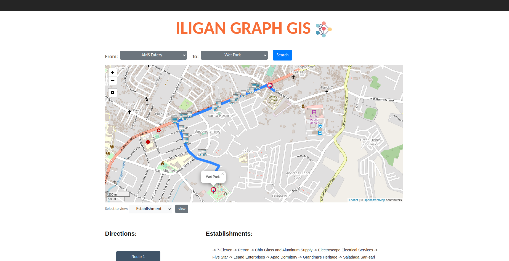

# Iligan Graph GIS

## About
This project aims to use neural networks to generate the shortest distance from point A to point B on a map. The system takes advantage of Django's backend capabilities and utilizes JavaScript, HTML5, CSS, Bootstrap, Networkx, and Leaflet to provide an interactive user experience.

## Technologies Used

## Features
- Utilizes neural networks to calculate the shortest distance between two points.
- Uses Leaflet map API to interact with the map.
- Displays an interactive map with establishments marked.
- Selectively view establishment type.
- Generates the optimal path along with a list of establishments you can visit.

## Screenshots

### Home Page

## Installation
1. Clone the repository: `git clone https://github.com/miggy-pg/iligan_graph_gis`
2. Navigate to the project directory: `cd iligan_graph_gis`
3. Create python virtual environment.
4. Install dependencies: `pip install -r requirements.txt`

## Contributing

Contributions are welcome! If you'd like to contribute to the Livre De Cuisine website, please follow these steps:

1. Fork the repository.
2. Create a new branch: `git checkout -b feature/your-feature-name`
3. Make your changes and commit them: `git commit -m "Add some feature"`
4. Push to your forked repository: `git push origin feature/your-feature-name`
5. Create a pull request.

## Contact

Feel free to reach out to me via email at phillip.mgalan@gmail.com or connect with me on [LinkedIn](https://www.linkedin.com/in/migui-galan/).
